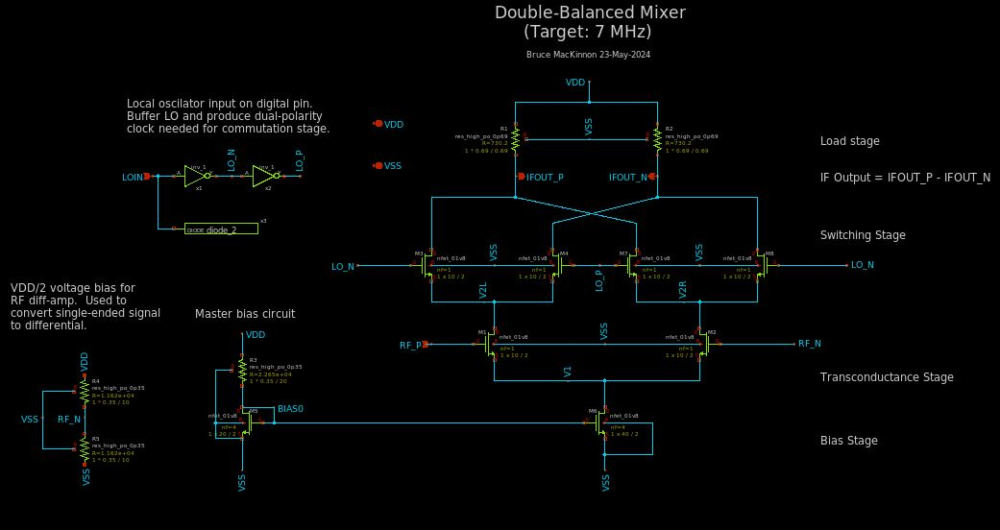
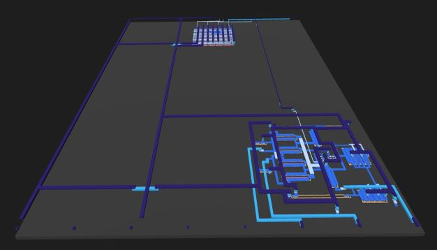

 

# Tiny Tapeout Analog Project

This is an analog/digital mixed signal design created for Tiny Tapeout 7. This is my first time through the ASIC design process and things are very experimental.
My ASIC tile contains a double balanced mixer (Gilbert Cell) and a quadrature 
clock generation circuit.

The more detailed documentation of the project [is located here](docs/info.md).

My analysis of some of the math behind balanced mixer operation can be found [here](docs/math.md).

My plan is to construct a complete receiver in future iterations of the design.
From what I have learned about the Skywater 130 ASIC technology so far this 
seems feasible.

My contact is bruce at mackinnon dot com. For any amateur radio operators looking 
at this project, I am KC1FSZ.

## The Mixer Schematic

## What the Device Layout Looks Like

This is a rendering that was created from the actual GDS2 files that will be sent 
to the chip fab.  

The mixer is in the foreground on the bottom of the tile and the quadrature divider is 
in the background towards the top. The mixer is oriented roughly 90 counter-clockwise
from the schematic diagram above. The long dark blue metal traces on the left side 
are the power/ground rails.

The entire area is rougly 170 microns wide and 230 micros tall.

Yes, there is plenty of space available for a more complicated design!

## What is Tiny Tapeout?

Tiny Tapeout is an educational project that aims to make it easier and cheaper than ever to get your digital designs manufactured on a real chip.

To learn more and get started, visit https://tinytapeout.com.

## Analog projects

For specifications and instructions, see the [analog specs page](https://tinytapeout.com/specs/analog/).

