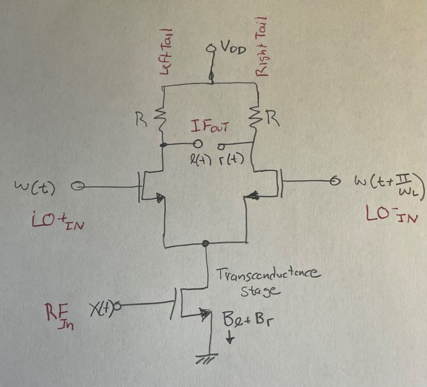
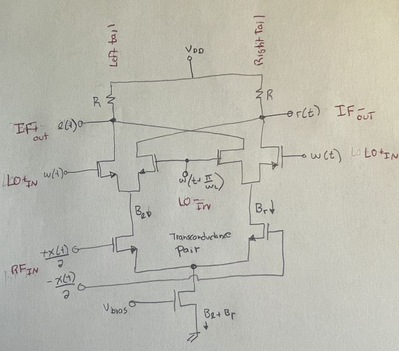

# Mixer Math

I've always known that double-balanced mixers are better than single-balanced mixers at suppressing
unwanted mixer products, but I've never known why. This is an attempt to show the math in the 
context of some simple MOSFET realizations of mixer circuits created for the [Tiny Tapeout](https://tinytapeout.com/).

## Why Does the LO Leak in a Single-Balanced MOSFET Mixer?

An ideal mixer takes RF and local oscilator (LO) signals and produces an intermediate frequency (IF) output 
signal at the sum (RF+LO) and difference (RF-LO) frequencies. 
A single-balanced mixer is a simple circuit, but it exhibits a non-ideal behavior by allowing either the RF or LO 
signal (depending on configuration) to 
appear at the output _in addition to_ the desired RF+LO and RF-LO signals. Often times this undesired mixer output 
is referred to as "leakage."

In the case of the single-balanced mixer, I don't think it's accurate to call this undesired output 
"leakage" because _the circuit was never designed to suppress the extra output in the first place._ But we'll stick with this
term for now. Whatever we call it, it is important to understand the mathematical reason for this undesired mixer output.

For this analysis we will use the following diagram of a simple single-balanced MOSFET mixer:

Some high-level assumptions that we are making for this analysis:

* Assume that the **LO input is balanced and the RF input is unbalanced.** This is the most common situation
in simple MOSFET mixers and it results in a leakage of the LO signal. If hookup was reversed then the RF signal 
would leak by exactly the same argument.
* Assume that we are talking about a switching mixer (sometimes called a commuting mixer) driven by an LO signal 
that is a square wave.  This is a common situation that comes up in radio circuits that use digitally-controlled 
tuning.  The LO is often created by a digital PLL that outputs a logic-level square wave.
* Assume that the RF input has a DC bias included to keep the bottom FET (the )

Getting formal, assume that:

* The LO signal is represented by a square wave $\ w(t)$ that alternates between 1 and 0 at an angular
frequency of $\ \omega_L $. 
* The RF signal $\ x(t)$ is a voltage that is applied to the transconductance stage of the mixer to produce a current of $\ g_mx(t)$.
* The LO square wave switches the RF-modulated current $\ x(t)$ between two tails of the mixer circuit.
* There is a load resistance of $\ R$ in each tail.  
* The voltage at the top of each tail is $\ V_{DD}$. This is the "off" level of the tail.
* The bias current brings the left tail's "on" voltage down by $\ RB_{l}$ volts or the right tail's "on" voltage by $\ RB_{r}$.  So 
with no RF input the "DC on" level of the left tail is $\ V_{DD} - RB_l$ and the right tail is left tail is $\ V_{DD} - RB_r$.  Normally 
we would expect $\ B_l = B_r $ since the circuit is symmetric.
* When on, the output voltage on the left tail $\ l(t) = V_{DD} - R \cdot ( B_l + g_mx(t))$.
* When on, the output voltage on the right tail $\ r(t) = V_{DD} - R \cdot ( B_r + g_mx(t))$.

The on/off switching action of the mixer can be thought of as a multiplication of the RF signal by the LO square wave 
that alternates between 1 and 0.  When the LO 
has the value of 1 the tail os on and the RF signal current is allowed to pass.  When the LO has the value of 0 the tail 
is off and the RF signal is suppressed.

A full representation of the differential IF output of the single-balanced MOSFET mixer is constructed as follows:

$$\ y(t) = l(t) - r(t)$$

The mixing action applies the LO to each tail in alternating opposite phase, so a time shift of $\ (2\pi/\omega_L)/2 $ seconds needs to 
be applied to the LO input on one tail of the mixer.

$$\ l(t) = V_{DD} - R \cdot w(t) ( B_l + g_mx(t) )$$

$$\ r(t) = V_{DD} - R \cdot w(t + \pi/\omega_L) (B_r + g_mx(t))$$

At this point we make two important assumptions that help with the mathematical analysis:

* We can represent the RF signal $\ x(t)$ as a sinusoid of the form, knowing that any arbitrary RF signal could be represented by a more complex series of sinusoids.

$$\ y(t) = A cos(\omega_Rt)$$

* We can represent the square wave of frequency $\ \omega_L$ as an infinite sum of the *odd* sinusoidal harmonics of $\ \omega_L$:

$$\ w(t) = {4 \over \pi} \sum_{n=1,3,5,...}^\infty {1 \over n} sin(n\omega_Lt) $$

Because the LO square wave is a sum of sinusoids, we can take advantage of the fact that applying the phase shift of $\ \pi/\omega_L $ to 
this sinusoidal series results in a change of sign. So:

$$\ w(t) = -w(t + \pi/\omega_L) $$

Back to the mixer output components:

$$\ l(t) = V_{DD} - R \cdot w(t) (B_l + g_mAcos(\omega_Rt)) $$

$$\ r(t) = V_{DD} - R \cdot w(t + \pi/\omega_L) (B_r + g_mAcos(\omega_Rt)) $$

Keeping in mind the above properly of a phase-shifted sinusoidal series:

$$\ l(t) = V_{DD} - R \cdot w(t) (B_l + g_mAcos(\omega_Rt)) $$

$$\ r(t) = V_{DD} + R \cdot w(t) (B_r + g_mAcos(\omega_Rt)) $$

So combining to form the IF output of the mixer:

$$\ y(t) = l(t) - r(t) = R \cdot w(t) (B_l + g_mAcos(\omega_Rt)) + w(t) (B_r + g_mAcos(\omega_Rt)) $$

$$\ y(t) = R \cdot w(t) (B_l + B_r) + 2 w(t) g_mAcos(\omega_Rt) $$

This is the most important part of the analysis. Notice that for any $\ B_l$ and $\ B_r$ where $\ B_l \neq -B_r$ **we end up with a 
scaled copy of $\ w(t)$ in the output of the mixer.**  The $\ V_{DD}$ offset goes away, but unless $\ B_l$ and $\ B_r$ are offsetting
somehow, the
LO will be present in $\ y(t)$.  That's not a leak, that's just how the circuit is designed to work.

Jumping ahead, the fundamental concept in the design of a double-balanced mixer is to arrange the circuit in such away that 
the $\ B$ terms subtract, at least conceptually. 

## How is the LO Suppressed in the Double-Balanced MOSFET Mixer?

This diagram of the standard Gilbert cell double-balanced mixer will be used as the basis
of the analysis.

The RF input and the LO input are both differential.  The IF output is also differential 
and is taken as the difference of the two tail voltages: $\ l(t) - r(t)$.

Because of the cross-connects in this circuit, each tail experiences current contribution 
from the positive and negative ends of the RF signal $\ x(t)$ at the same time. Similarly, each 
tail experiences part of the bias currents $\ B_r$ and $\ B_l$.

As before, let the RF signal be represented by a cosine function:

$$\ x(t) = Acos(\omega_Rt) $$

We write the expression for the output voltage in the left and right tails of the circuit:

$$\ l(t) = V_{DD} - R \cdot ( w(t){g_mAcos(\omega_Rt) \over 2} + w(t)B_l + w(t+\pi/\omega_L){-g_mAcos(\omega_Rt) \over 2} + w(t+\pi/\omega_L)B_r ) $$

$$\ r(t) = V_{DD} - R \cdot ( w(t+\pi/\omega_L){g_mAcos(\omega_Rt) \over 2} + w(t+\pi/\omega_L)B_l + w(t){-g_mAcos(\omega_Rt) \over 2} + w(t)B_r ) $$

Taking advantage of this relationship again:

$$\ w(t) = -w(t + \pi/\omega_L) $$

And taking the difference of the two tail output voltages we end up with:

$$\ y(t) = R \cdot ( 4w(t){g_mAcos(\omega_Rt) \over 2} + 2w(t)(B_l - B_r) ) $$

And this leads to the important result.  Unlike the the single-balanced case where $\ Br$ and $\ B_l$ are added, 
in the double-balanced case they are subtracted.  So when $\ Br = B_l$ the right-hand term that involves the 
raw LO signal $\ w(t)$ drops out.  That is the mathematical definition of LO suppression.

This highlights the criticality of symmetry in this circuit. Any mismatch between $\ Br$ and $\ B_l$ will allow 
some component of the LO signal to leak into the mixer output.

